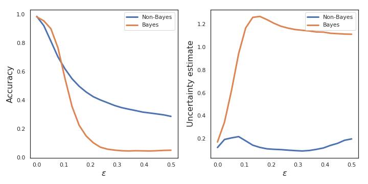
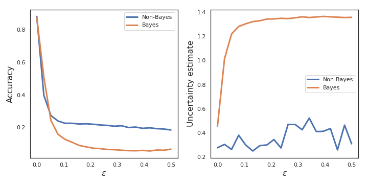
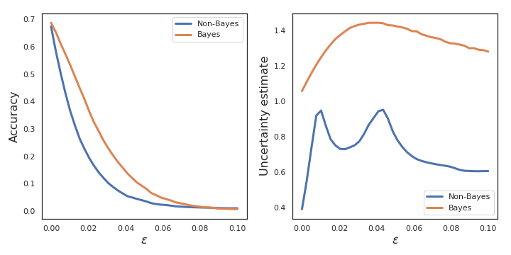
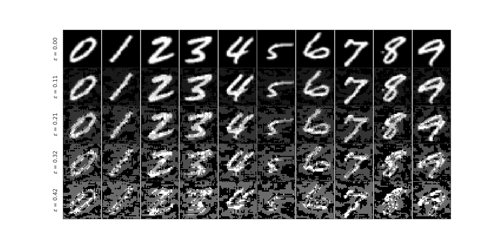
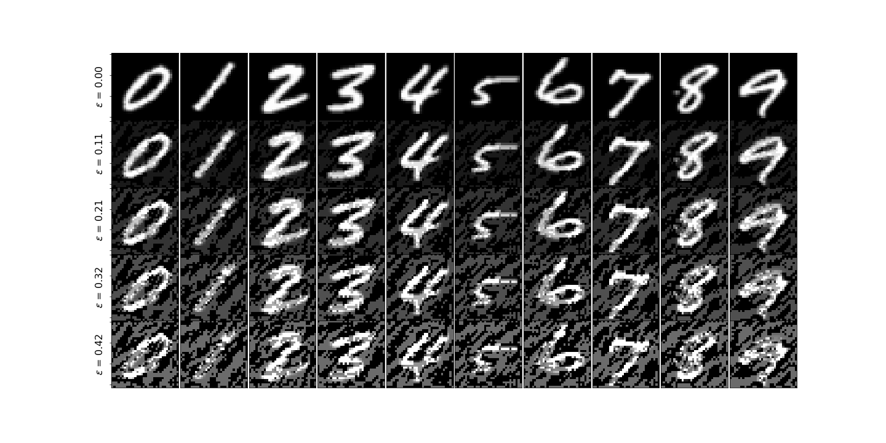
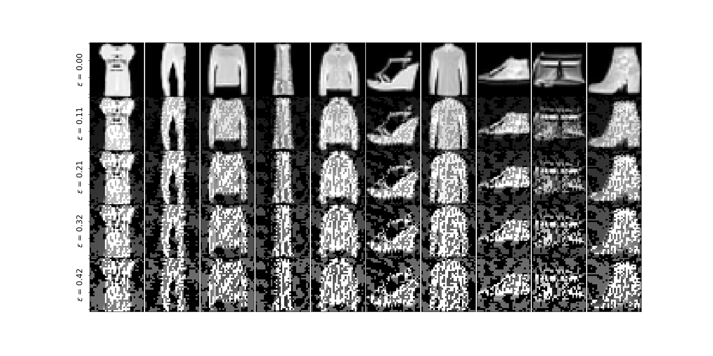
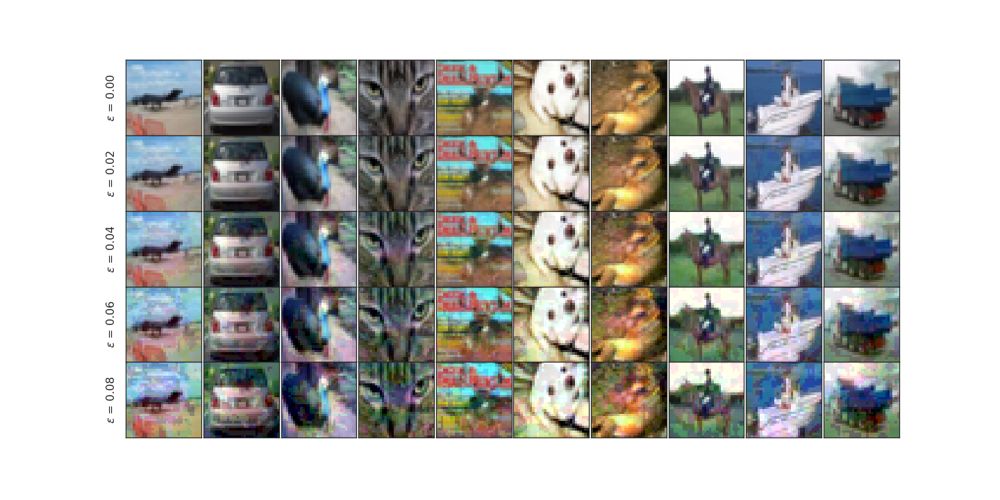
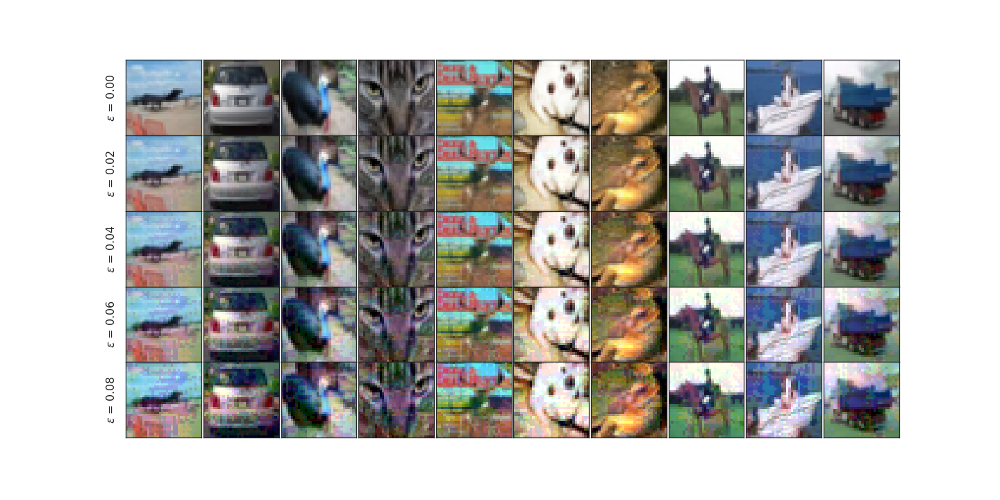

# Examining-Robustness-of-BNNs-to-Adversarial-Examples

This is course project for ECE 590: ML for Security.

---------------------------------------------------------------------------------------------------------

### MNIST RESULTS

---------------------------------------------------------------------------------------------------------

### Fashion MNIST RESULTS

---------------------------------------------------------------------------------------------------------

### CIFAR10 RESULTS

---------------------------------------------------------------------------------------------------------

## FGSM on Bayesian and Frequentist models

